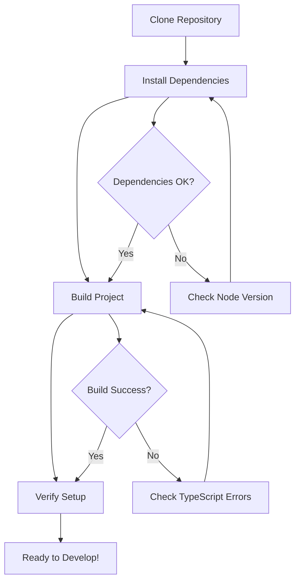

# utility-ts - Developer Onboarding Guide

**Last Updated:** 2025-01-27

## Welcome to utility-ts! 🎉

This guide will help you get started as a developer on the utility-ts project.

## Prerequisites

### Required Tools

- Node.js >= 14.0.0
- pnpm (recommended) or npm/yarn
- Git
- A code editor with TypeScript support (VS Code recommended)

### Account Requirements

- GitHub account with repository access
- npm account (if publishing)

## Quick Start

### Setup Flow



### 1. Repository Setup

```bash
# Clone the repository
git clone git@github-first:Arunkumarcs/utility-ts.git
cd utility-ts

# Install dependencies
pnpm install
# or
npm install
```

### 2. Build Project

```bash
# Build the project
pnpm run build
# or
npm run build

# This compiles TypeScript to JavaScript in the dist/ directory
```

### 3. Verification

```bash
# Verify the build succeeded
ls dist/

# You should see compiled .js, .d.ts, and .js.map files
```

## Development Workflow

### Workflow Diagram

```mermaid
gitgraph
    commit id: "Initial"
    branch dev
    checkout dev
    commit id: "Setup"
    
    branch feature/new-utility
    checkout feature/new-utility
    commit id: "Add utility function"
    commit id: "Add tests"
    commit id: "Update docs"
    
    checkout dev
    merge feature/new-utility
    commit id: "Feature merged"
    
    checkout main
    merge dev
    commit id: "Release v1.x.x"
```

### Branch Management

- `main` - Production-ready code, latest stable release
- `dev` - Integration branch for features
- `feature/*` - Feature development branches
- `hotfix/*` - Critical bug fixes

### Code Standards

- Follow TypeScript best practices
- Use strict TypeScript configuration
- Write JSDoc comments for all public functions
- Follow existing code style and formatting
- Ensure all exports are typed

### Commit Guidelines

Follow conventional commit format:

```
type(scope): description

Examples:
feat(cdk): add stack naming utility
fix(naming): resolve resource name generation issue
docs(readme): update installation instructions
refactor(utils): improve function organization
```

## Project Structure

```
utility-ts/
├── src/                    # Source code
│   ├── index.ts           # Main entry point
│   ├── utils/             # General utilities module
│   │   ├── index.ts       # Utils module entry
│   │   ├── process-utils.ts
│   │   ├── fs-utils.ts
│   │   ├── date/              # Date utilities (subdirectory)
│   │   ├── string/             # String utilities (subdirectory)
│   │   ├── array/              # Array utilities (subdirectory)
│   │   ├── object/             # Object utilities (subdirectory)
│   │   ├── promise-utils.ts
│   │   ├── lambda-utils.ts
│   │   ├── zod-utils.ts
│   │   ├── powertools-utils.ts
│   │   └── ... (30+ utility modules)
│   ├── cdk/               # CDK utilities module
│   │   ├── index.ts       # CDK module entry
│   │   ├── types.ts       # Type definitions
│   │   ├── naming.ts      # Naming utilities
│   │   ├── tags.ts        # Tagging utilities
│   │   ├── environment.ts # Environment utilities
│   │   ├── context.ts     # Context utilities
│   │   ├── stack-info.ts  # Stack info utilities
│   │   ├── outputs.ts     # Output utilities
│   │   ├── stack.ts       # Stack utilities
│   │   └── services/      # Service-specific utilities
│   │       ├── lambda.ts
│   │       ├── sns.ts
│   │       ├── sqs.ts
│   │       └── ... (20+ service modules)
│   └── middy/             # Middy middleware utilities
│       ├── index.ts       # Middy module entry
│       ├── types.ts       # Type definitions
│       ├── middleware.ts  # Middleware functions
│       ├── handlers.ts    # Handler utilities
│       └── zod-middleware.ts # Zod validation
├── dist/                  # Compiled output (generated)
├── docs/                  # Documentation
│   ├── architecture.md    # Architecture documentation
│   ├── onboarding.md      # This file
│   ├── contributing.md    # Contributing guidelines
│   └── adr/               # Architecture Decision Records
├── .cursor/               # Cursor IDE rules and templates
├── package.json           # Package configuration
├── tsconfig.json          # TypeScript configuration
└── README.md              # Project README
```

### Key Directories

- `src/utils/` - General utility functions (30+ modules)
- `src/cdk/` - AWS CDK utilities (core + 20+ service modules)
- `src/middy/` - Middy middleware utilities
- `dist/` - Compiled output (do not edit directly)
- `docs/` - Project documentation
- `.cursor/` - IDE configuration and templates

## Development Environment

### Local Development

1. **Make Changes**: Edit files in `src/`
2. **Build**: Run `pnpm run build` to compile
3. **Test**: Run tests (when implemented)
4. **Verify**: Check that dist/ contains updated files

### Watch Mode

For continuous compilation during development:

```bash
pnpm run build:watch
# or
npm run build:watch
```

This will automatically recompile when you save changes.

### Testing

```bash
# Run all tests (when test suite is added)
pnpm test

# Run with coverage
pnpm test:coverage
```

### Debugging

- Use TypeScript compiler errors to identify issues
- Check `dist/` output to verify compilation
- Use source maps for debugging compiled code

## Architecture Overview

utility-ts is a modular TypeScript utility library organized into logical modules:

### Key Components

1. **Main Entry Point** (`src/index.ts`): Re-exports all public APIs
2. **General Utilities** (`src/utils.ts`): General-purpose functions
3. **CDK Module** (`src/cdk/`): AWS CDK-specific utilities organized by function:
   - **Types**: Type definitions and interfaces
   - **Naming**: Stack and resource naming
   - **Tags**: Resource tagging
   - **Environment**: Environment detection
   - **Context**: Stack context management
   - **Stack Info**: Stack metadata
   - **Outputs**: CloudFormation outputs

### Module Design

Each module is self-contained and can be imported independently:

```typescript
// Import from main entry
import { generateStackName } from 'utility-ts';

// Or import from specific module
import { generateStackName } from 'utility-ts/cdk/naming';
```

## API Documentation

See the source code for JSDoc comments on all functions. Key utilities include:

### CDK Utilities

- **Naming**: `generateStackName()`, `generateResourceName()`, `generateUniqueId()`
- **Tags**: `applyCommonTags()`, `applyDefaultTags()`
- **Environment**: `getEnvironment()`, `isProduction()`, `isDevelopment()`, `getEnvConfig()`
- **Context**: `getContext()`, `validateContext()`
- **Stack Info**: `getAccountId()`, `getRegion()`
- **Outputs**: `createOutput()`

## Common Tasks

### Adding a New Utility Function

1. Create feature branch: `git checkout -b feature/new-utility-name`
2. Add function to appropriate module (or create new module if needed)
3. Add JSDoc documentation
4. Export from module's index file
5. Export from main `src/index.ts` if it's a top-level utility
6. Build and verify: `pnpm run build`
7. Update documentation if needed
8. Submit pull request

### Adding a New CDK Utility Module

1. Create new file in `src/cdk/` (e.g., `new-module.ts`)
2. Implement utilities following existing patterns
3. Export from `src/cdk/index.ts`
4. Add types to `src/cdk/types.ts` if needed
5. Update architecture documentation
6. Build and test

### Fixing a Bug

1. Create hotfix branch: `git checkout -b hotfix/bug-description`
2. Fix the issue
3. Add regression test if applicable
4. Build and verify: `pnpm run build`
5. Submit pull request

### Updating Documentation

1. Edit relevant documentation file in `docs/`
2. For ADRs, create new file in `docs/adr/`
3. Follow existing documentation style
4. Submit pull request

## Troubleshooting

### Common Issues

#### Issue: TypeScript compilation errors

**Solution:** 
- Check `tsconfig.json` configuration
- Ensure all imports are correct
- Verify Node.js version >= 14.0.0
- Run `pnpm install` to ensure dependencies are installed

#### Issue: Build output not updating

**Solution:**
- Run `pnpm run clean` to remove old build files
- Run `pnpm run build` again
- Check for TypeScript errors that prevent compilation

#### Issue: Module not found errors

**Solution:**
- Verify the module is exported from its index file
- Check that the main `src/index.ts` exports the module
- Ensure the build completed successfully

### Getting Help

- Check existing documentation in `docs/`
- Review source code comments
- Search closed issues in GitHub
- Open a new issue with details about your problem

## Resources

### Documentation

- [Architecture Documentation](architecture.md)
- [README](../README.md)
- [Contributing Guidelines](contributing.md) (when created)

### External Resources

- [TypeScript Documentation](https://www.typescriptlang.org/docs/)
- [AWS CDK Documentation](https://docs.aws.amazon.com/cdk/)
- [Semantic Versioning](https://semver.org/)
- [Conventional Commits](https://www.conventionalcommits.org/)

### Learning Resources

- [TypeScript Handbook](https://www.typescriptlang.org/docs/handbook/intro.html)
- [AWS CDK Workshop](https://cdkworkshop.com/)
- [Node.js Best Practices](https://github.com/goldbergyoni/nodebestpractices)

## Next Steps

1. **Complete Setup**: Ensure all prerequisites are installed and working
2. **Explore Codebase**: Familiarize yourself with the project structure
3. **Read Architecture Docs**: Understand the design decisions
4. **Try the Utilities**: Import and use utilities in a test project
5. **Pick First Issue**: Look for "good first issue" labels in GitHub
6. **Start Contributing**: Make your first contribution!

## Feedback

This onboarding guide is a living document. If you encounter issues or have suggestions for improvement, please:

- Open an issue with the "documentation" label
- Submit a pull request with improvements
- Provide feedback to the maintainers

---

**Need Help?** Don't hesitate to open an issue or reach out to the maintainers.

